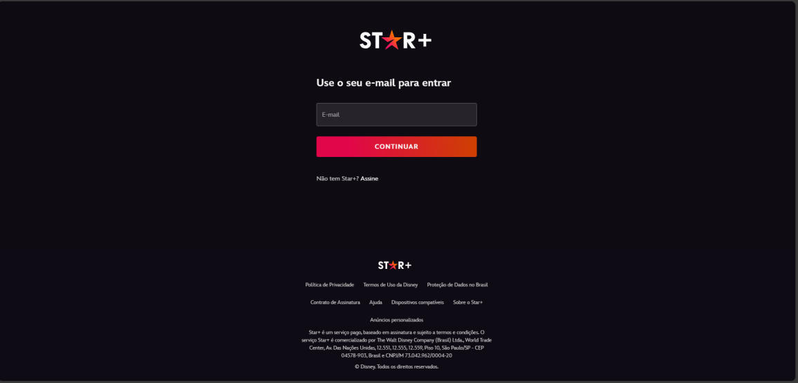

# Projeto: Desenvolvimento Web - Página de Login
Repositório do projeto individual de Desenvolvimento Web desenvolvido durante a Residência TIC/Software do Serratec.

# O projeto consiste na criação de uma página de login, seguindo os critérios estabelecidos pela disciplina. Aqui estão os requisitos específicos:
-Desenvolver uma página de login clonada.
-Trabalho individual.
-Utilizar useState para o login e a senha.
-Implementar um botão que altera uma variável, e quando essa variável muda, usar useEffect para verificar se a senha e o login estão corretos
-Utilizar o styles.module.css para estilização;
-Incluir no repositório do Git, juntamente com o código, a imagem que foi utilizada como referência para a clonagem.

## Inspiração para a página de login
<h1 align="center">
    
</h1>
